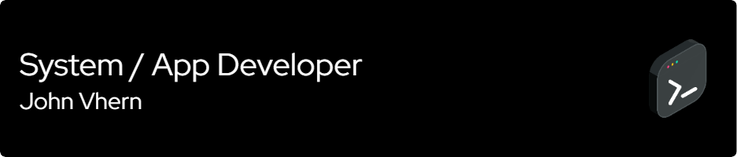

# 💫 About Me:
Hi! I'm John Vhern Dela Cruz, an aspiring system / app developer. I'm passionate about building practical and impactful solutions through software development.  I specialize in:  Desktop Applications using C#, WinForms, and .NET Framework  Web Development with HTML5, CSS3, and Bootstrap  Database Management with Microsoft SQL Server (MSSQL)  🚀 My notable projects include:  RosalES – A learner profiling and assessment system used by a local school to manage student data and generate academic reports.  BoardMate – A boarding house management system that handles unit availability, boarder info, and financial transactions.  🛠 I also have experience in:  IT support and network troubleshooting (via OJT at Asia Pacific Medical Center – Aklan)  Using tools like Git, Jira, Figma, Adobe XD, and Canva for development and UI/UX design.  🎓 I’m a consistent Academic Excellence Awardee (2019–2024) and hold certifications in Java Foundations, System Administration (Linux), and Project Management Essentials.

## 🌐 Socials:
     

# 💻 Tech Stack:
        
# 📊 GitHub Stats:
 
 

## 🏆 GitHub Trophies

---

<!-- Proudly created with GPRM ( https://gprm.itsvg.in ) -->
