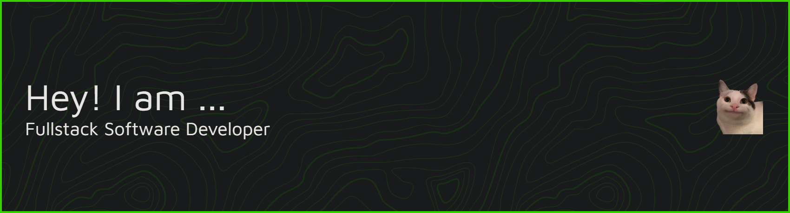

<h2 align="left">Hi 👋! My name is John Vhern and I'm a Full-Stack Sofware Developer, from Aklan.</h2>

###

💻 Core Skills & Tools  Languages & Frameworks: C#, .NET Framework, Java, JavaScript, HTML, CSS Databases: MSSQL, Supabase, Room Mobile Development: Android (Java, Fragments), API integration Web Development: Frontend (Tailwind), Backend (Supabase, REST APIs) System Development: POS & Inventory systems, Authentication & Role-based access, Reporting & Analytics Other Experience: Network troubleshooting, IT support, router configuration, endpoint maintenance  🚀 Projects I’ve worked on  Learner Profiling & Assessment System (C# / MSSQL) QR Attendance System (C# / MSSQL)  🌱 Currently Exploring  Building production-ready Desktop Application Entity Framework with Dependency Injection Syncfusion Winforms UI Library  📫 Let’s connect! Feel free to check out my repositories

###

  
  

###

  
  
  
  
  
  
  
  
  
  
  
  
  
  
  
  
  
  
  
  
  
  
  
  
  
  
  
  
  

###

  
  
  
  
  

###

 

###

  

###
